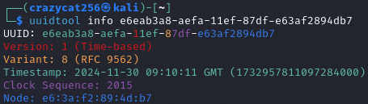
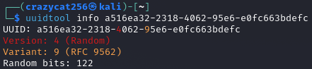
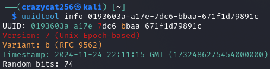

# UUIDTool - A tool to manipulate UUIDs

UUIDTool is a command-line utility designed to work with Universally Unique Identifiers (UUIDs). It allows users to generate, analyze, and manipulate UUIDs in several ways

## Disclaimer

This tool is intended to be used in CTF challenges, penetration testing, and other ethical hacking activities. Do not use it for illegal or malicious purposes.

## Installation

```bash
pip install uuidtool
```

If you use an [externally managed environment](https://packaging.python.org/en/latest/specifications/externally-managed-environments/):

```bash
sudo apt install pipx
pipx install uuidtool
```

Or

```bash
git clone https://github.com/crazycat256/uuidtool.git
cd uuidtool
pipx install .
```

## Usage

**Commands:**

- [info](#info) - Get information about a UUID
- [edit](#edit) - Edit a UUID
- [new](#new) - Generate a new UUID
- [range](#range) - Generate all UUIDs whose timestamps are close to that of a given UUID
- [sandwich](#sandwich) - Generate all UUIDs whose timestamps are between those of two given UUIDs

**Options:**

Timestamps (`-t` / `--time`):

This options supports seconds and nanoseconds since the Unix epoch as well as iso8601 timestamps

```bash
-t 1732723900169486375
-t 1732723900
-t 2024-11-27T17:11:40
```

Sorting modes (`-s` / `--sort`):

- `asc`: Sort in ascending order (`[t-3, t-2, t-1, t, t+1, t+2, t+3]`)
- `desc`: Sort in descending order (`[t+3, t+2, t+1, t, t-1, t-2, t-3]`)
- `alt`: Sort in alternating order (`[t, t+1, t-1, t+2, t-2, t+3, t-3]`)

By default, `alt` is used

### Info

#### Usage

```bash
uuidtool info <uuid>
```

#### Examples





### Edit

#### Usage

```bash
uuidtool edit <uuid> [options]
```

#### Options

```bash
  -t TIME, --time TIME  Time to use for the UUID v1, v2, v6 or v7
  -c CLOCK_SEQUENCE, --clock-sequence CLOCK_SEQUENCE
                        Clock sequence to use for UUID v1 or v2
  -n NODE, --node NODE  Node (MAC address) to use for UUID v1, v2 or v6
  --local-id LOCAL_ID   Local ID to use for UUID v2
  --local-domain LOCAL_DOMAIN
                        Local domain to use for UUID v2
  --custom-a CUSTOM_A   Custom field A to use for UUID v8
  --custom-b CUSTOM_B   Custom field B to use for UUID v8
  --custom-c CUSTOM_C   Custom field C to use for UUID v8
```

#### Examples

```bash
$ uuidtool edit e63034d3-acc1-11ef-8aaf-e63af2894db7 -t 1732713730 -n 11:22:33:44:55:66
9b3eed00-acc2-11ef-8aaf-112233445566

$ uuidtool edit 01936dc5-a16a-7d24-b038-dd8b3e962c8c -t 0
00000000-0000-7d24-b038-dd8b3e962c8c

$ uuidtool edit 000003e8-acc2-21ef-b100-e63af2894db7 --local-id 1001 --local-domain 1
000003e9-acc2-21ef-b101-e63af2894db7
```

### New

#### Usage

```bash
uuidtool new [options]
```

#### Options

```bash
  -v VERSION, --version VERSION
                        UUID version
  -t TIME, --time TIME  Time to use for UUID v1, v2, v6 or v7
  -c CLOCK_SEQUENCE, --clock-sequence CLOCK_SEQUENCE
                        Clock sequence for UUID v1 or v2
  -n NODE, --node NODE  Node (MAC address) for UUID v1, v2 or v6
  --local-id LOCAL_ID   Local ID for UUID v2
  --local-domain LOCAL_DOMAIN
                        Local domain for UUID v2
  --name NAME           Name for UUID v3 or v5
  --namespace NAMESPACE
                        Namespace for UUID v3 or v5
  --custom-a CUSTOM_A   Custom field A for UUID v8
  --custom-b CUSTOM_B   Custom field B for UUID v8
  --custom-c CUSTOM_C   Custom field C for UUID v8
```

#### Examples

```bash
$ uuidtool new
ee505478-a4fc-4c7d-9361-10f6a261f404

$ uuidtool new -v 1 -t 1732718667 -c 0
19ed5780-acce-11ef-8000-e63af2894db7

$ uuidtool new -v 5 --namespace @dns --name HelloWorld
013a3dd2-e0e8-5595-891b-2135ce7321c3
```

### Range

#### Usage

```bash
uuidtool range <uuid> <count> [options]
```

#### Options

```bash
  -s {asc,desc,alt}, --sort {asc,desc,alt}
                        Sort mode for the UUID range
```

#### Example

```bash
$ uuidtool range e3aa7ac2-acd6-11ef-b995-e63af2894db7 5
e3aa7ac2-acd6-11ef-b995-e63af2894db7
e3aa7ac1-acd6-11ef-b995-e63af2894db7
e3aa7ac3-acd6-11ef-b995-e63af2894db7
e3aa7ac0-acd6-11ef-b995-e63af2894db7
e3aa7ac4-acd6-11ef-b995-e63af2894db7

$ uuidtool renge 000003e8-acd7-21ef-9e00-e63af2894db7 5 -s asc
000003e8-acd5-21ef-9e00-e63af2894db7
000003e8-acd6-21ef-9e00-e63af2894db7
000003e8-acd7-21ef-9e00-e63af2894db7
000003e8-acd8-21ef-9e00-e63af2894db7
000003e8-acd9-21ef-9e00-e63af2894db7
```

### Sandwich

#### Usage

```bash
uuidtool sandwich <uuid1> <uuid2> [options]
```

#### Options

```bash
  -s {asc,desc,alt}, --sort {asc,desc,alt}
                        Sort mode for the UUID range
```

#### Example

```bash
$ uuidtool sandwich 4977ce85-acd9-11ef-801a-e63af2894db7 4977ce8b-acd9-11ef-801a-e63af2894db7
4977ce88-acd9-11ef-801a-e63af2894db7
4977ce87-acd9-11ef-801a-e63af2894db7
4977ce89-acd9-11ef-801a-e63af2894db7
4977ce86-acd9-11ef-801a-e63af2894db7
4977ce8a-acd9-11ef-801a-e63af2894db7
```

## License

This project is licensed under the MIT License - see the [LICENSE](LICENSE) file for details
